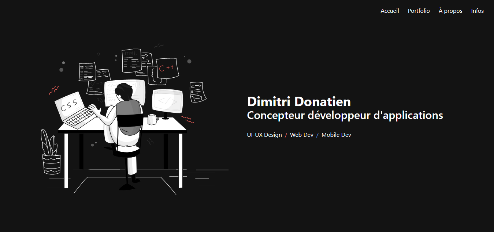

# portfolio

## Badges

[](https://github.com/dimitri-donatien/Portfolio/issues)
[](https://github.com/dimitri-donatien/Portfolio/network)
[](https://github.com/dimitri-donatien/Portfolio/stargazers)

[](https://github.com/dimitri-donatien/Portfolio)


## Application Description

Il s'agit de mon portfolio.

## Screenshot / GIF of the application (Demo)



## Technology Stack

| Front-End  | Back-End |
| ---------- | -------- |
| HTML       |          |
| Tailwind   |          |
| SCSS       |          |
| Vue.JS     |          |
| JavaScript |          |

## Project setup

```
npm install
```

### Compiles and hot-reloads for development

```
npm run serve
```

### Compiles and minifies for production

```
npm run build
```

### Lints and fixes files

```
npm run lint
```

### Customize configuration

See [Configuration Reference](https://cli.vuejs.org/config/).